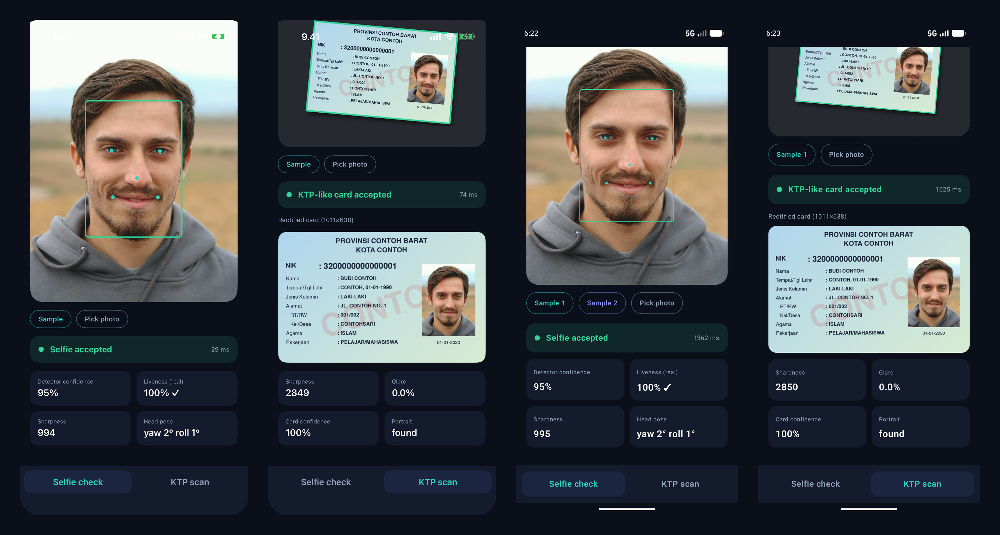
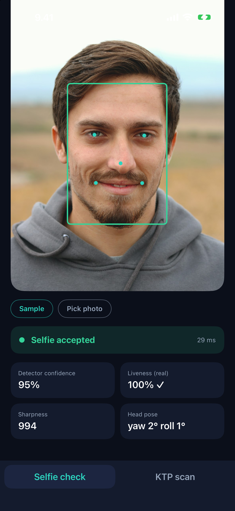
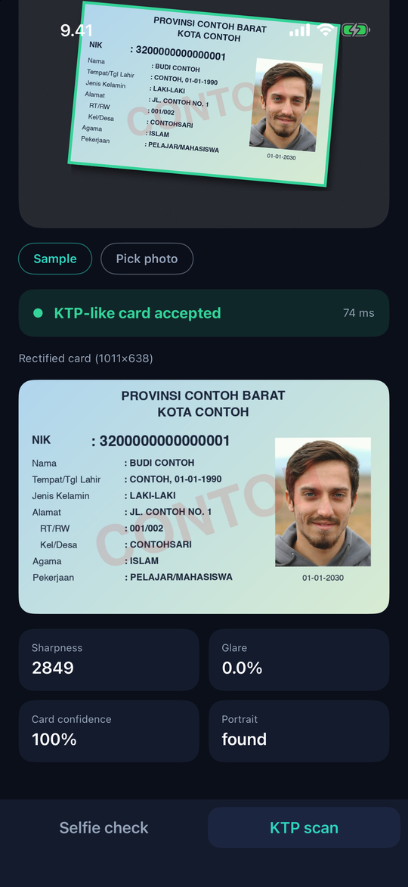
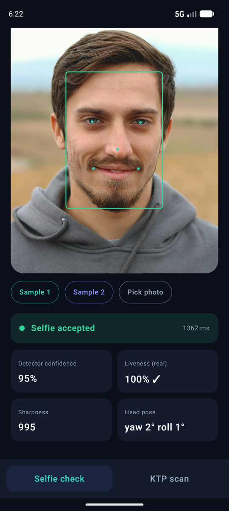
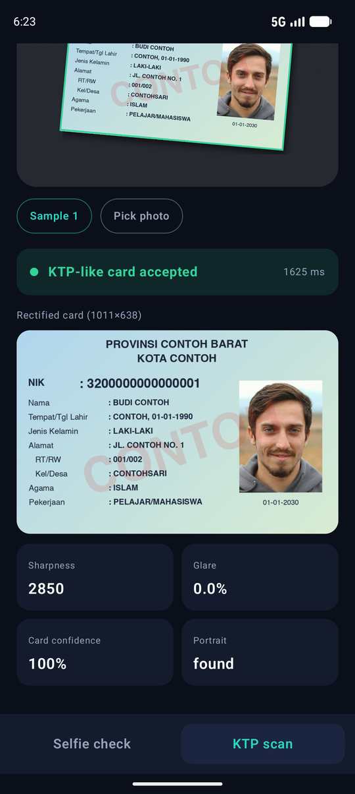

# Faktel (Bahasa Indonesia)

**Deteksi wajah dan Kartu Tanda Penduduk (e-KTP) Indonesia di perangkat, untuk Kotlin Multiplatform.**

Faktel adalah library open source (Apache-2.0) yang menjalankan pipeline computer-vision langsung di perangkat -
tanpa server, tanpa SDK CV vendor - dengan satu API Kotlin untuk Android, iOS, dan JVM desktop.
Dokumentasi lengkap (bahasa Inggris) ada di [docs/README.md](docs/README.md).

<p align="center">
  
</p>

<p align="center"><sub>
  Output asli <a href="samples/README.md">aplikasi contoh</a> (SwiftUI di simulator iPhone, Jetpack Compose di emulator Android)
  yang menjalankan model bawaan langsung di perangkat. Foto: Duman Photography / Unsplash; kartu adalah contoh fiktif buatan.
</sub></p>

## Fitur

| Kemampuan | Kelas utama |
|---|---|
| Deteksi wajah + 5 landmark | `YuNetFaceDetector` |
| Cek kualitas wajah (ukuran, blur, cahaya, sudut kepala) | `FaceQualityAssessor` |
| Liveness pasif (foto cetak / replay layar sederhana) | `MiniFasNetLivenessDetector` |
| Embedding & pencocokan selfie dengan foto KTP | `ArcFaceEmbedder`, `FaceMatcher` |
| Deteksi & rektifikasi kartu KTP | `ClassicalKtpDetector`, `KtpScanner` |
| Validasi KTP: rasio 1,586, ukuran, blur, glare, posisi foto | `KtpScanner` |

## Lihat hasilnya

Folder [`samples/`](samples/README.md) berisi dua aplikasi contoh modern - **Jetpack Compose** (Android) dan **SwiftUI**
(iOS) - yang menjalankan pipeline asli langsung di perangkat:

| Cek selfie | Scan KTP |
|---|---|
|  |  |
|  |  |

- **Cek selfie**: kotak wajah + 5 landmark, skor detektor, skor liveness pasif, ketajaman, dan sudut kepala.
- **Scan KTP**: kontur kartu, kartu hasil rektifikasi 1011x638, ketajaman, glare, posisi foto.

Kode integrasi hanya satu file per platform ([Kotlin](samples/android/app/src/main/kotlin/io/github/cybersafetyid/faktel/sample/FaktelEngine.kt),
[Swift](samples/ios/FaktelDemo/FaktelEngine.swift)). Cara menjalankan: [samples/README.md](samples/README.md).

## Instalasi

```kotlin
kotlin {
    sourceSets {
        commonMain.dependencies {
            implementation("io.github.cybersafetyid.faktel:faktel:<versi>")
        }
    }
}
```

Lalu siapkan bagian platform sekali saja: [Android](docs/guides/android.md), [iOS](docs/guides/ios.md),
[JVM](docs/guides/jvm.md). Model bawaan (YuNet, MiniFASNetV2) ada di folder [`models/`](models/MODELS.md).

## Contoh singkat

```kotlin
val analyzer = FaceAnalyzer(
    detector = YuNetFaceDetector(engine, yunetBytes),
    liveness = MiniFasNetLivenessDetector(engine, fasBytes),
)
val hasil = analyzer.analyze(frame)          // deteksi -> kualitas -> liveness
if (hasil.isAcceptable) { /* ambil foto */ } else { tampilkanPetunjuk(hasil.issues) }
```

```kotlin
val scan = KtpScanner(faceDetector = YuNetFaceDetector(engine, yunetBytes)).scan(foto)
if (scan.isAcceptable) { val kartu = scan.card!! } else { tampilkanPetunjuk(scan.issues) }
```

## Batasan penting

- Liveness bersifat **pasif satu frame**: menahan serangan foto cetak/layar biasa, **bukan** anti-spoofing tersertifikasi.
- Modul KTP hanya memeriksa bahwa objek **tampak seperti KTP** (bentuk, ukuran, fokus, glare, posisi foto). Tidak membaca
  teks (OCR) dan tidak mendeteksi pemalsuan.
- Detektor kartu bawaan butuh latar polos yang kontras dan ada margin di sekeliling kartu. Detektor berbasis model
  ada di [roadmap](docs/roadmap.md).
- Ambang batas bawaan hanyalah titik awal; kalibrasi di perangkat Anda ([panduan](docs/guides/tuning.md)).
- Gambar KTP dan wajah adalah **data pribadi**: proses di perangkat, jangan simpan gambar mentah
  ([panduan privasi](docs/guides/privacy-and-security.md)).

## Kontribusi

Kontributor sangat diterima! Baca [CONTRIBUTING.md](CONTRIBUTING.md) dan [Kode Etik](CODE_OF_CONDUCT.md).
Versi mengikuti [SemVer](docs/development/versioning.md); perubahan dicatat di [CHANGELOG](CHANGELOG.md).

## Terverifikasi

Model asli (YuNet, MiniFASNetV2, ArcFace MobileFaceNet) sudah dijalankan end-to-end lewat ONNX Runtime di JVM desktop,
simulator iPhone, **dan** emulator Android (lewat [aplikasi contoh](samples/README.md)). Belum diukur: latensi di
ponsel Android kelas menengah asli; emulator juga belum otomatis di CI
([rincian](docs/development/testing.md)).

## Kontribusi & lisensi

Kontribusi sangat diterima: lihat [CONTRIBUTING.md](CONTRIBUTING.md). Lisensi [Apache 2.0](LICENSE); bobot model punya
lisensinya sendiri ([models/MODELS.md](models/MODELS.md), [NOTICE](NOTICE)).
